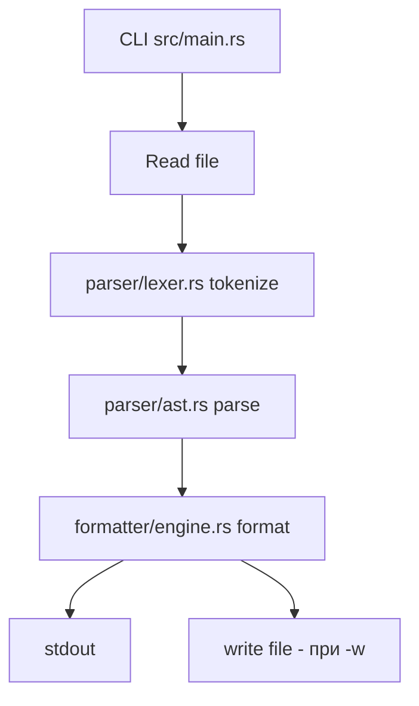
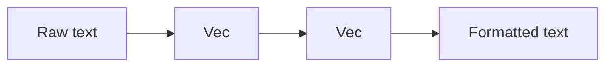
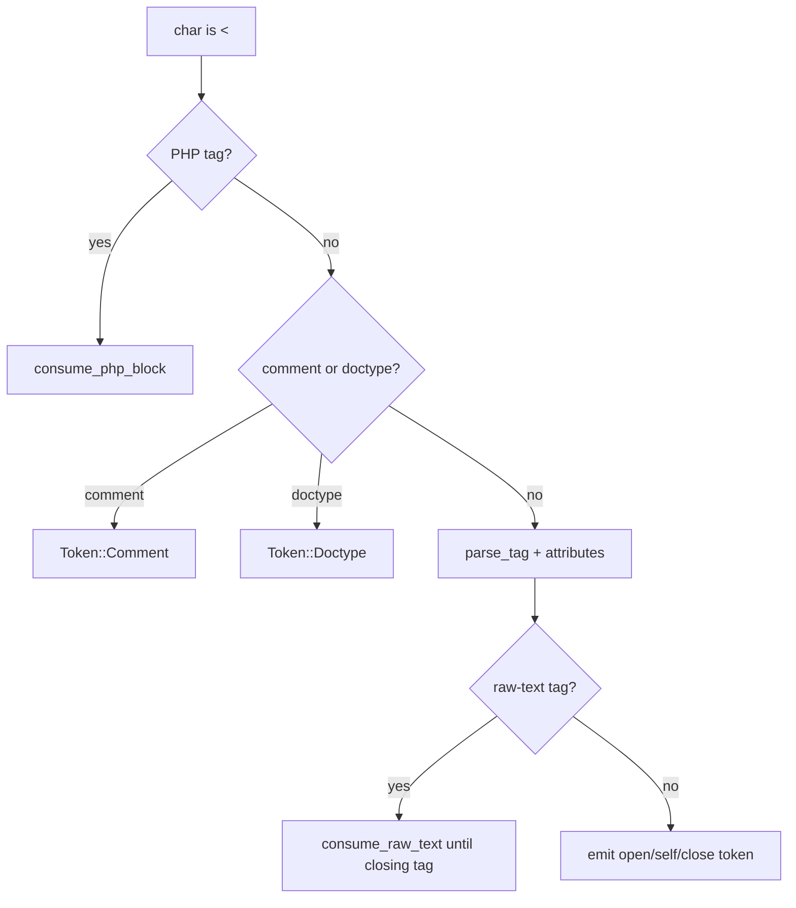
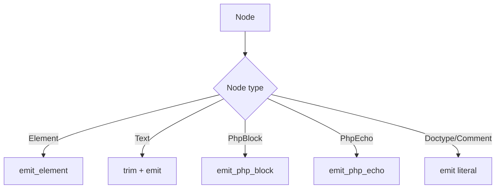
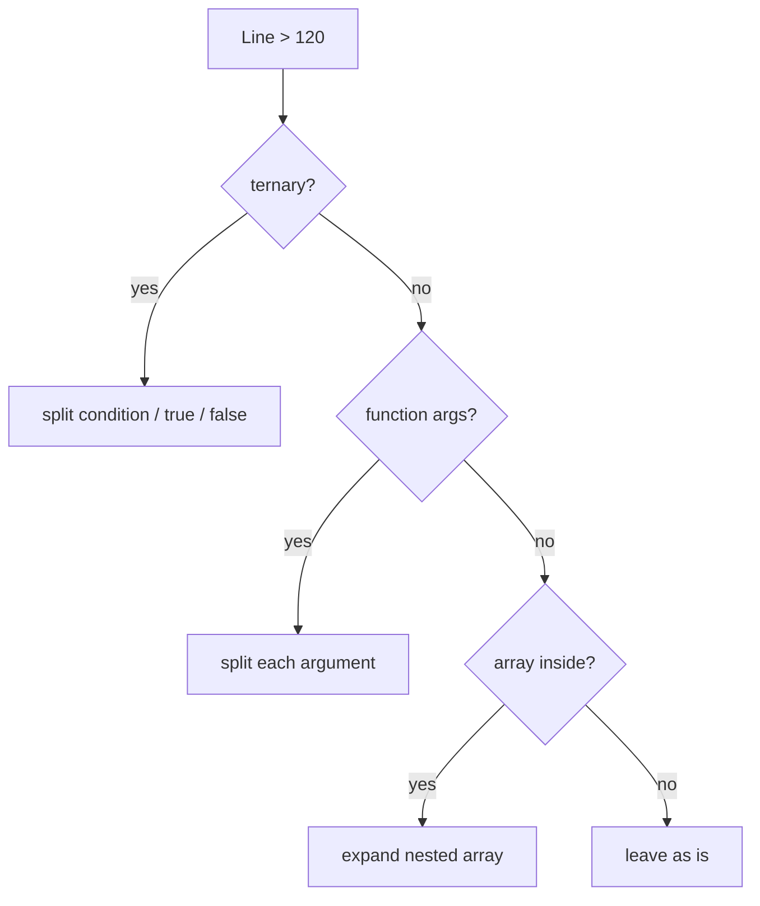
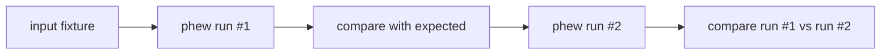

# Как работает phew

Этот документ - технический обзор всего пайплайна без привязки к конкретной роли.  
Если нужен короткий старт, смотри `docs/quick-start.md`.

## Пайплайн от CLI до вывода

## Как устроены входные данные

Типы токенов:

- Токен `Text`.
- Токены `OpenTag`, `CloseTag`, `SelfClosing`.
- Токены `PhpBlock`, `PhpEcho`.
- Токены `Doctype`, `Comment`.

Типы узлов:

- Узел `Element`.
- Узел `Text`.
- Узел `PhpBlock`.
- Узел `PhpEcho`.
- Узел `Doctype`.
- Узел `Comment`.

## Лексер: ключевые правила

Лексер (`src/parser/lexer.rs`) идет по символам и на каждом `<` выбирает сценарий:

1. PHP (`<?php`, `<?=`, `<?`).
2. Комментарий (`<!-- -->`).
3. `<!DOCTYPE ...>`.
4. Обычный HTML-тег.

Отдельные edge-cases:

- Теги `script/style/textarea` читаются как raw-text, чтобы не ломать JS/CSS/текст.
- Последовательность `?>` внутри строк PHP не завершает блок преждевременно.
- PHP внутри HTML-атрибутов не теряется.

## AST: как строится дерево

Парсер (`src/parser/ast.rs`) держит стек открытых HTML-тегов и текущий список узлов.

- Токен `OpenTag` пушится в стек.
- Токен `CloseTag` разматывает стек до нужного тега.
- PHP, текст, doctype и comment попадают как листовые ноды.
- В конце файла стек принудительно unwind-ится, чтобы дерево было завершено.

## Formatter engine: где принимаются решения

Основная функция `format_nodes` в `src/formatter/engine.rs`:

- Обходит AST.
- Поддерживает текущую глубину отступов.
- Учитывает специальные правила для `switch/case`, header-блоков и long lines.

### Состояние отступов в PHP

`PhpDepthState` хранит:

- Поле `depth` - текущий уровень вложенности.
- Поле `switch_stack` - уровни открытых `switch`.

Это нужно, чтобы `case/default/break/endswitch` имели корректный уровень и не "гуляли" при сложной вложенности.

## Почему `switch/case` реализован отдельно

Для alt-синтаксиса PHP важно, чтобы между `switch` и первым `case` не было вывода.

Поэтому в `emit_php_block` есть отдельная ветка:

- Нормализует инструкции.
- Если видит `switch` и сразу `case`, печатает их в одном PHP-блоке.
- Дальше ведет глубину через `switch_stack`.

Это защищает от синтаксических ошибок на реальных view.

## Как делятся длинные строки

В `engine.rs` и `php.rs` работает многоступенчатая стратегия:

1. Попробовать разбить тернарный оператор.
2. Попробовать разбить вызов по аргументам.
3. Раскрыть вложенные массивы.
4. Для `<?= ... ?>` отдельно обработать цепочки (`->`) и конкатенацию (`.`).

## Header merge на top-level

Если в начале файла рядом стоят несколько PHP-блоков с `declare/use/phpdoc`, formatter:

1. Склеивает их.
2. Форматирует как единый header.
3. Убирает шум `?><?php`.

Это реализовано в `format_nodes` + `emit_php_block` + `reindent_php_block`.

## Почему фикстуры - главный источник правды

`bin/check-fixtures` проверяет сразу три вещи:

- У `input` есть соответствующий `expected`.
- Первый проход совпадает с `expected`.
- Второй проход идентичен первому (идемпотентность).

## Куда смотреть при проблемах

- Подозрение на распознавание входа: `phew --tokens`.
- Подозрение на структуру дерева: `phew --tree`.
- Подозрение на переносы/отступы: `src/formatter/engine.rs`.
- Подозрение на spacing и split helper-ы: `src/formatter/php.rs`.

## Какие документы читать дальше

- Для быстрого применения в проекте: `docs/quick-start.md`.
- Для доработки formatter-а на уровне Rust: `docs/rust-developer-guide.md`.
- Для практики в Yii2 view-коде: `docs/php-developer-guide.md`.
