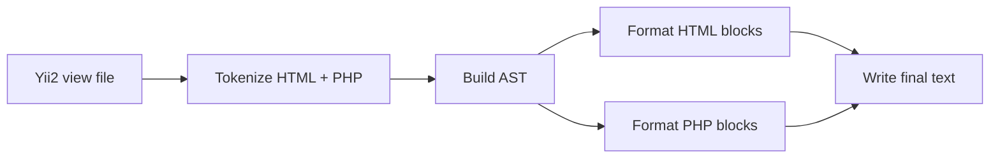

# Руководство для PHP/Yii2-разработчиков

Этот документ показывает, что именно делает `phew` с реальными view-файлами, где HTML и PHP перемешаны.

## Что происходит с файлом при запуске



`phew` не делает магию "по регуляркам". Он строит структуру и уже потом печатает код заново.

## Что форматируется в шаблонах

- Конструкции `if/elseif/else`, `foreach`, `for`, `while`, `switch/case` в alt-стиле и brace-стиле.
- Блоки `<?= ... ?>` и `<?php ... ?>`.
- Большие конфиги виджетов (`ActiveForm`, `GridView`, `DetailView`, `Nav`, `Pjax`, `Modal`).
- Длинные цепочки вызовов и длинные списки аргументов.
- Базовые пробелы PHP (`if (...)`, `'key' => $value`, `$a = $b`, запятые).

## Что форматтер держит как инвариант

- Отступ всегда `4` пробела.
- Лимит строки целится в `120` символов.
- В конце файла всегда ровно один перевод строки.
- Повторный прогон не меняет уже отформатированный файл.

## Безопасный `switch/case` в шаблонах

Для alt-синтаксиса важно, чтобы между `switch` и первым `case` не было вывода.

Поэтому форматтер приводит код к такому виду:

```php
<?php switch ($viewModel->step):
    case 'intro': ?>
    <div class="step step-intro">...</div>
    <?php break; ?>
<?php endswitch; ?>
```

Это валидный шаблонный PHP и безопасный формат.

## Как форматируется header (`use`, `declare`, `phpdoc`)

Если в начале файла идут соседние PHP-блоки с `use`, `declare`, docblock, `phew` сначала склеивает их, а потом печатает как аккуратный header.

Пример целевого стиля:

```php
<?php

use yii\helpers\Html;
use yii\widgets\ActiveForm;

/**
 * @var \common\models\User $model
 */

?>
```

За счет этого не появляется шум `?><?php` между соседними header-фрагментами.

## Как делятся длинные строки

Порядок действий для длинных выражений:

1. Пробует разбить тернарник.
2. Пробует разбить вызов по аргументам.
3. Если есть вложенные массивы, раскрывает их по уровням.
4. Для `<?= ... ?>` отдельно пробует цепочки `->` и конкатенации `.`.

Это особенно полезно для больших Yii-конфигов:

- Массивы `columns`, `attributes`, `items`.
- Длинные `Html::a(...)`, `Url::to(...)`, `ArrayHelper::map(...)`.

## Что форматтер сознательно не трогает

- Содержимое `<script>`, `<style>`, `<textarea>`.
- Текст в `registerJs(...)`, `registerCss(...)`.
- Текст heredoc/nowdoc и длинные многострочные литералы.
- Бизнес-логику и семантику PHP-кода.

Если нужен стиль JS/CSS, применяй профильный JS/CSS форматтер отдельно.

## Типовой командный цикл в проекте

```bash
# Локально привести шаблоны к стилю
phew -w views/

# Проверить, что кодовая база стабильно проходит проверки
just check
```

## Что делать, если результат кажется странным

```bash
# Посмотреть токены
phew --tokens path/to/view.php

# Посмотреть AST
phew --tree path/to/view.php
```

Если токены уже "кривые", проблема в распознавании входа. Если токены нормальные, а вывод спорный, проблема в правилах форматирования.

## Как завести новый edge-case в проект

1. Создай файл в `tests/fixtures/input/NN_name.php`.
2. Сгенерируй expected: `bin/update-fixtures`.
3. Проверь регрессии: `just fixtures`.
4. Проверь юниты: `just test`.

Это самый быстрый путь зафиксировать поведение для нового шаблонного кейса.
