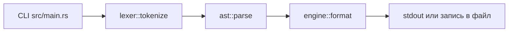
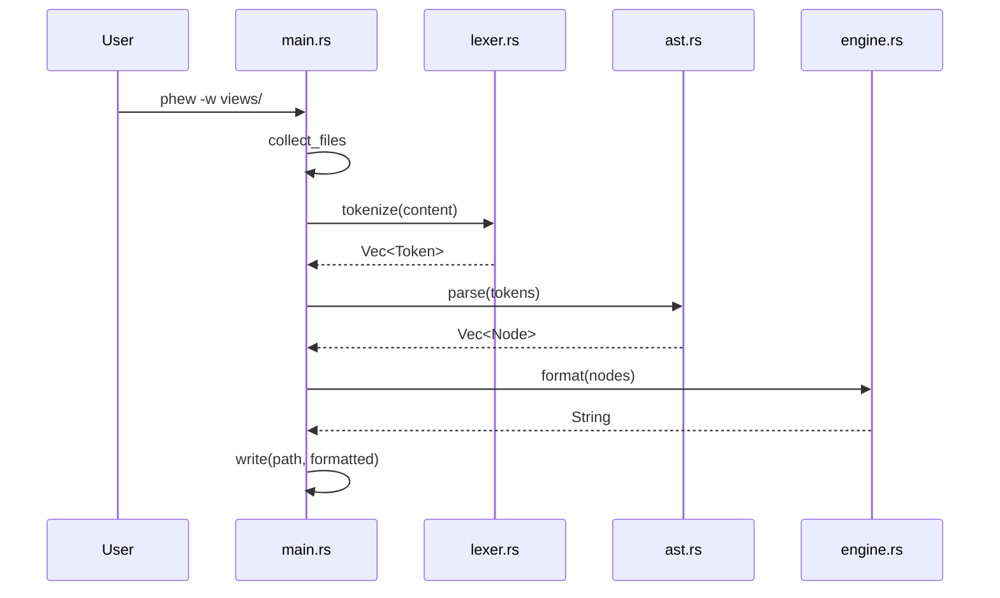

# Руководство для Rust-разработчиков

Этот документ объясняет, как реально устроен код `phew`, какие инварианты он держит и куда безопасно вносить изменения.

## Входная точка и общий поток

CLI живет в `src/main.rs`:

- Собирает аргументы (`--write`, `--tokens`, `--tree`, пути).
- Раскрывает директории в список `.php/.html` файлов (`collect_files`).
- Для каждого файла запускает пайплайн.





## Что является моделью данных

### Токены (`src/parser/lexer.rs`)

- Токен `Text`.
- Токен `OpenTag`.
- Токен `CloseTag`.
- Токен `SelfClosing`.
- Токен `PhpBlock`.
- Токен `PhpEcho`.
- Токен `Doctype`.
- Токен `Comment`.

### Узлы AST (`src/parser/ast.rs`)

- Узел `Node::Element { name, attributes, children }`.
- Узел `Node::Text`.
- Узел `Node::PhpBlock`.
- Узел `Node::PhpEcho`.
- Узел `Node::Doctype`.
- Узел `Node::Comment`.

`ast::parse` строит дерево через стек открытых тегов и аккуратно unwind-ит незакрытые узлы в конце.

## Как работает лексер

Важный порядок обработки в `tokenize`:

1. Видим `<`.
2. Пробуем PHP (`try_consume_php`), включая `<?php`, `<?=`, `<?`.
3. Пробуем комментарий `<!-- -->`.
4. Пробуем `<!DOCTYPE ...>`.
5. Иначе читаем HTML-тег.

Особые случаи:

- Константа `RAW_TEXT_ELEMENTS = script/style/textarea`: содержимое читается как сырой текст до закрывающего тега.
- PHP внутри атрибутов не теряется, он упаковывается как отдельный атрибут без значения.
- Функция `consume_php_block` не рвет блок на `?>` внутри строк.

## Как работает форматтер

Главная функция - `format_nodes` в `src/formatter/engine.rs`.

Она держит `PhpDepthState`:

- Поле `depth`: текущая глубина отступа.
- Поле `switch_stack`: уровни вложенных `switch`.

```mermaid
stateDiagram-v2
    [*] --> Plain
    Plain --> BlockOpen: opener if/foreach/for/while/switch/::begin
    BlockOpen --> Plain: closer endif/endforeach/endfor/endwhile/::end
    BlockOpen --> SwitchBody: switch + case/default
    SwitchBody --> SwitchBody: case/default/break
    SwitchBody --> Plain: endswitch
```

### Ветки форматирования

- HTML: `emit_element`, `emit_open_tag`, `format_inline`.
- PHP block: `emit_php_block`.
- PHP echo: `emit_php_echo` и `format_echo`.
- Многострочный PHP: `reindent_php_block`.

## Как сделан line splitting

Лимит строки задается константой `MAX_LINE_LENGTH = 120`.

Порядок попыток в `try_split_long_line`:

1. Разбить тернарник (`find_ternary_positions`).
2. Разбить вызов по аргументам (`split_by_args` + `build_split`).
3. Разбить массив внутри аргумента (`expand_nested_array`, `expand_bare_array`).
4. Рекурсивно разбить вложенные длинные части.

Для `<?= ... ?>` есть отдельные ветки:

- Функция `split_by_chain` для цепочек вызовов.
- Функция `split_by_concat` для конкатенации.
- Функция `format_echo_array_split` для большого последнего аргумента-массива.

## Критичные инварианты

### Идемпотентность

Повторный прогон должен дать тот же результат. Это проверяется в `bin/check-fixtures` двойным запуском formatter-а.

### Безопасный `switch/case`

Нельзя выводить пробелы/переносы между `switch` и первым `case`.

Реализация:

- Функция `normalize_statements` бьет PHP-код на инструкции.
- В `emit_php_block` есть специальная ветка, где `switch` и первый `case` выводятся в одном PHP-блоке.

### Стабильный header на top-level

В `format_nodes` соседние top-level `PhpBlock`, относящиеся к `use/declare/phpdoc`, сначала склеиваются, потом форматируются одним проходом.

Это убирает эффект "дребезга" вида `?><?php`.

### Не трогать чужие языки

JS/CSS в raw-text зонах и heredoc/nowdoc внутри PHP не должны ломаться.

Реализация:

- Константа `RAW_TEXT_ELEMENTS` в лексере.
- В `reindent_php_block` есть трекинг открытых строк и heredoc marker.

## Куда вносить изменения

- PHP spacing и low-level split helper-ы: `src/formatter/php.rs`.
- Политика переноса и отступов: `src/formatter/engine.rs`.
- Токенизация и edge-cases входного потока: `src/parser/lexer.rs`.
- Структура AST и unwind закрывающих тегов: `src/parser/ast.rs`.

## Практика правок без регрессий

```bash
# 1) Локально тесты модулей
just test

# 2) Проверка fixture-пар и идемпотентности
just fixtures

# 3) Если меняется целевой вывод - обновить expected
bin/update-fixtures
```

## Быстрый чеклист перед PR

- Все тесты зеленые: `just test`.
- Фикстуры зеленые: `just fixtures`.
- Нет случайных изменений вне области задачи.
- Не сломаны `switch/case`, header-блоки и raw-text поведение.
- Повторный запуск formatter-а не меняет уже отформатированный файл.
